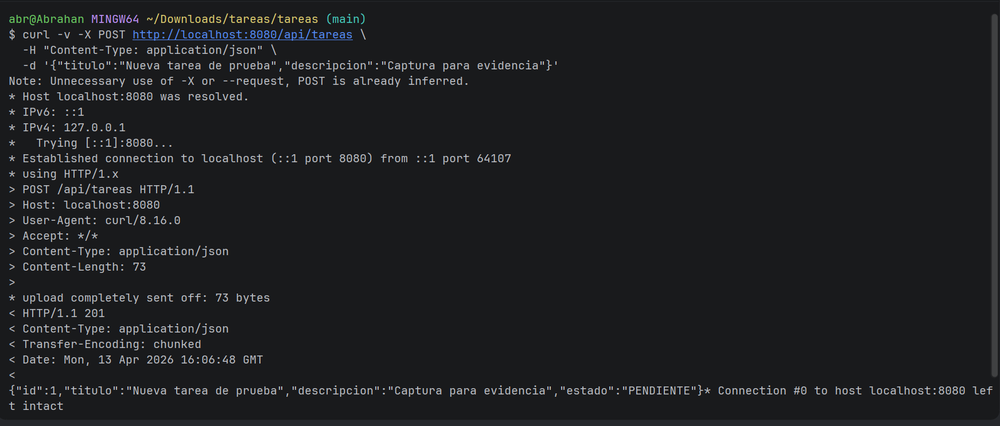
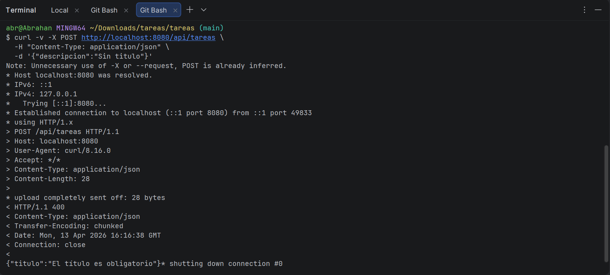
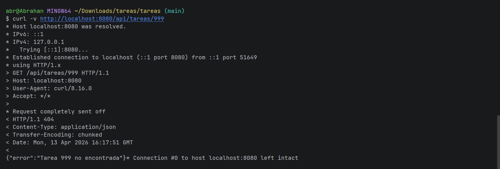

# Sistema de Gestión de Tareas

API REST desarrollada con **Spring Boot 3.x** aplicando arquitectura en capas estricta como parte del laboratorio de Patrones Arquitectónicos I — Unidad 7.

---

## Arquitectura en Capas

El proyecto está organizado en cuatro capas con responsabilidades claramente definidas y sin dependencias cruzadas:

```
┌─────────────────────────────────────────────┐
│        Capa de Presentación                 │
│   controller/  (@RestController)            │
│   Traduce peticiones HTTP a llamadas        │
│   al servicio. No contiene lógica           │
│   de negocio.                               │
└────────────────────┬────────────────────────┘
                     │
┌────────────────────▼────────────────────────┐
│        Capa de Aplicación                   │
│   service/  (@Service)                      │
│   Contiene la lógica de negocio y           │
│   orquesta el repositorio. No conoce        │
│   detalles HTTP.                            │
└────────────────────┬────────────────────────┘
                     │
┌────────────────────▼────────────────────────┐
│        Capa de Dominio                      │
│   domain/  (Entidades + Excepciones)        │
│   Define las entidades del negocio          │
│   y las excepciones de dominio.             │
└────────────────────┬────────────────────────┘
                     │
┌────────────────────▼────────────────────────┐
│        Capa de Infraestructura              │
│   repository/  (@Repository)               │
│   Acceso a datos mediante JPA.              │
│   Extiende JpaRepository.                  │
└─────────────────────────────────────────────┘
```

### Estructura de Paquetes

```
com.example.tareas/
├── controller/
│   ├── TareaController.java         ← Endpoints REST
│   └── GlobalExceptionHandler.java  ← Manejo global de errores
├── service/
│   └── TareaService.java            ← Lógica de negocio
├── domain/
│   ├── TareaNotFoundException.java  ← Excepción de dominio
│   └── model/
│       ├── Tarea.java               ← Entidad JPA
│       └── EstadoTarea.java         ← Enum de estados
├── repository/
│   └── TareaRepository.java        ← Repositorio JPA
└── TareasApplication.java
```

---

## Requisitos

| Herramienta | Versión |
|-------------|---------|
| Java JDK | 17 o superior |
| Spring Boot | 3.5.13 |
| Maven | 3.8+ |
| IDE | IntelliJ IDEA / VS Code |

---

## Cómo Ejecutar

**1. Clonar el repositorio:**
```bash
git clone https://github.com/Abrahan07/Patrones-Remolina-post1-u7.git
cd Patrones-Remolina-post1-u7
```

**2. Compilar el proyecto:**
```bash
mvn clean compile
```

**3. Ejecutar la aplicación:**
```bash
mvn spring-boot:run
```

La aplicación quedará disponible en `http://localhost:8080`

**4. Acceder a la consola H2 (base de datos en memoria):**
```
http://localhost:8080/h2-console
```
- JDBC URL: `jdbc:h2:mem:tareasdb`
- Usuario: `sa`
- Contraseña: *(vacía)*

---

## Endpoints Disponibles

| Método | URL | Descripción | Código de respuesta |
|--------|-----|-------------|---------------------|
| GET | `/api/tareas` | Listar todas las tareas | 200 OK |
| GET | `/api/tareas/{id}` | Buscar tarea por ID | 200 OK / 404 Not Found |
| POST | `/api/tareas` | Crear nueva tarea | 201 Created |
| PATCH | `/api/tareas/{id}/estado` | Cambiar estado de tarea | 200 OK |
| DELETE | `/api/tareas/{id}` | Eliminar tarea | 204 No Content |

### Estados disponibles
```
PENDIENTE → EN_PROGRESO → COMPLETADA
```

---

## Ejemplos de Uso con curl

**Listar todas las tareas:**
```bash
curl http://localhost:8080/api/tareas
```

**Crear una tarea:**
```bash
curl -X POST http://localhost:8080/api/tareas \
  -H "Content-Type: application/json" \
  -d '{"titulo":"Estudiar patrones arquitectonicos","descripcion":"Repasar arquitectura en capas"}'
```

**Buscar tarea por ID:**
```bash
curl http://localhost:8080/api/tareas/1
```

**Cambiar estado de una tarea:**
```bash
curl -X PATCH "http://localhost:8080/api/tareas/1/estado?estado=EN_PROGRESO"
```

**Eliminar una tarea:**
```bash
curl -X DELETE http://localhost:8080/api/tareas/1
```

---

## Evidencias de Pruebas

**POST /api/tareas — 201 Created:**


**POST sin título — 400 Bad Request:**


**GET con ID inexistente — 404 Not Found:**

